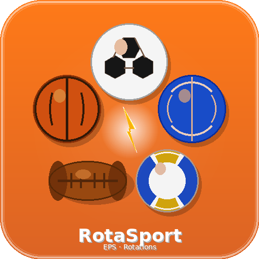

# ⚡ RotaSport EPS

<p align="center">
  
</p>

<p align="center">
  <strong>Application PWA de gestion de rotations sportives pour professeurs d'EPS</strong><br/>
  Fonctionne hors-ligne · Installable sur tablette iOS & Android
</p>

<p align="center">
  
  
  
  
</p>

---

## 🎯 Fonctionnalités

### 👨‍🏫 Mode Professeur (protégé par code PIN)
- **Gestion des classes** — plusieurs classes indépendantes
- **Import des élèves** — saisie manuelle ou import Excel/CSV
- **Configuration des rôles** — Joueur, Arbitre (terrain entier), Coach/Observateur (par équipe), avec nombre configurable
- **Format de jeu** — 1v1 à 7v7, 1 à 10 terrains simultanés
- **Durée des matchs** — de 1 à 30 minutes
- **Code PIN modifiable** — protège l'accès au paramétrage

### 🔄 Rotations équilibrées (algorithme)
- Chaque élève joue **avec** et **contre** un maximum d'élèves différents
- Chaque élève passe par **tous les rôles** de manière équilibrée
- Affichage clair par terrain : Équipe A / Équipe B / Rôles annexes

### ⚽ Suivi des matchs
- Chronomètre individuel par match (avec alerte 30s)
- **Score parlant** : boutons +1 / +10 / +100 pour chaque équipe
- Points individuels (bonus par joueur)
- Annulation du dernier point

### 📊 Statistiques individuelles
- **Tableau Score parlant** — % de points à 1pt / 10pts / 100pts, coloré selon la dominante
  - 🟠 Orange : dominante 1pt
  - 🟢 Vert clair : dominante 10pts
  - 🌲 Vert foncé : dominante 100pts
- Historique complet des matchs (résultats, partenaires, adversaires)
- Export CSV et TXT par élève

---

## 📱 Installation sur tablette

### iOS (iPad / iPhone)
1. Ouvrir **Safari** et naviguer vers l'URL du site
2. Appuyer sur **Partager** (📤)
3. Sélectionner **"Sur l'écran d'accueil"**
4. Confirmer → l'app apparaît avec le logo RotaSport

### Android (tablette / téléphone)
1. Ouvrir **Chrome** et naviguer vers l'URL du site
2. Menu (⋮) → **"Installer l'application"** ou **"Ajouter à l'écran d'accueil"**
3. Confirmer → l'app apparaît avec le logo RotaSport

> ✅ Une fois installée, l'application **fonctionne entièrement hors-ligne**.

---

## 🚀 Déploiement (GitHub Pages)

1. **Fork** ou clone ce dépôt
2. Aller dans `Settings` → `Pages`
3. Source : `Deploy from a branch` → branche `main` → dossier `/ (root)`
4. Sauvegarder — l'URL sera : `https://[votre-username].github.io/[nom-du-repo]/`

> ⚠️ Le Service Worker (mode hors-ligne) nécessite **HTTPS** — GitHub Pages le fournit automatiquement.

---

## 📁 Structure des fichiers

```
rotasport-eps/
├── index.html          ← Application complète (HTML + CSS + JS)
├── sw.js               ← Service Worker (cache offline)
├── manifest.json       ← Configuration PWA
├── logo.png            ← Logo 512×512 (app store / splash)
├── icon-512.png        ← Icône 512×512
├── icon-192.png        ← Icône 192×192 (Android)
├── apple-touch-icon.png← Icône 180×180 (iOS)
├── favicon-32.png      ← Favicon 32×32 (onglet navigateur)
└── README.md           ← Ce fichier
```

---

## 🔐 Sécurité

- **Code PIN 4 chiffres** — protège le paramétrage et la gestion des classes
- **PIN par défaut : `1234`** — à modifier dès la première utilisation
- Les élèves n'ont accès qu'aux onglets **Rotations**, **Match** et **Stats**
- Chaque classe est **totalement indépendante** — les données ne se mélangent pas

---

## 💾 Stockage des données

Toutes les données sont stockées **localement** sur l'appareil via `localStorage` :
- Aucun serveur, aucun compte
- Les données persistent entre les sessions
- Effacer le cache du navigateur supprime les données

---

## 🛠️ Technologies

- **HTML5 / CSS3 / JavaScript** — aucun framework
- **Service Worker API** — fonctionnement hors-ligne
- **Web App Manifest** — installation native sur tablette
- **SheetJS** (CDN) — import Excel/CSV (chargé à la demande)
- **Google Fonts** — Nunito + Exo 2

---

## 📖 Guide d'utilisation rapide

1. **Mode Prof** → saisir le PIN → configurer la classe et les élèves
2. Choisir les rôles et le format de jeu → **Générer les rotations**
3. Sur l'écran Rotations → appuyer sur un terrain → saisir les scores
4. À la fin → **Terminer ce match**
5. Onglet **Stats** → appuyer sur un élève pour voir sa fiche

---

## 👨‍🏫 Destiné aux professeurs d'EPS

Conçu pour une utilisation sur tablette en salle de sport ou sur le terrain. Interface claire et accessible pour les élèves, contrôle total pour le professeur.

---

*Développé avec ❤️ pour l'EPS française*
